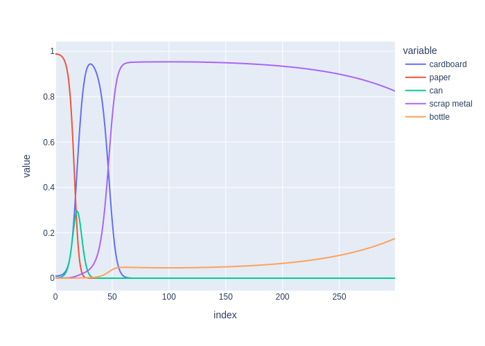

# 3.2. 随时间推移的行动

> 使用概率语言来描述动作效果具有不确定性的系统。

在现实世界中，由于各种原因，机器人并不总是完美地执行动作。为了对执行作时的不确定性进行建模，我们将再次使用概率语言。我们将使用条件概率分布来模拟我们如何通过动作影响机器人的状态。回想一下，在第 2 章中，我们使用了条件概率来模拟不确定性在特定时刻感知的影响。在这里，我们使用条件概率来模拟执行 action 时状态转换的不确定性。

我们可以使用图形对此进行建模，其中有向边指定了变量的条件概率。我们可以使用这些 “图形模型” 为固定的动作序列生成 samplesystem 轨迹。这样的样本轨迹可以用于规划，我们将在本章后面看到。此外，图形模型方法使我们能够轻松地将概率作扩展到因式分解状态表示，这可以提供显着的计算优势。

在我们的例子中，我们假设我们的机器人配备了导航软件，它实现了四个原始动作：向左移动、向右移动、向上移动、向下移动，我们将用 L、R、U、D 表示。这四个动作一起定义了动作空间。这些动作的名义效应（即不考虑不确定性的动作效应）是根据动作指定的方向将机器人从当前房间移动到相邻房间。例如，从客厅执行 move down 作应该会将机器人带入走廊。

<figure><figcaption>
图1 我们的机器人配备了四个原始动作：左、右、上和下。
</figcaption></figure>

我们可以通过对上一节中的状态空间图进行轻微修改来以图形方式表示这些作。每个作都贡献一条有向边，而不是使用无向边来表示邻接，如图 1 所示。请注意，为了简化表示法，我们使用 L、R、U、D 而不是 move left、move right、move up、move down 来标记边缘。
