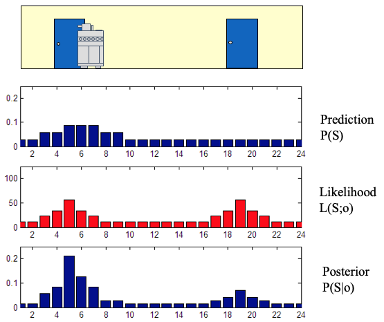

# 3.5.4.使用控制带展开来近似预期效用

> Rollin'， rollin'， rollin'...

考虑确定仅包含两个作的序列的 expectedutility 所需的计算：

$$
\begin{equation}
E[U(a_1,a_2, X_1, X_2, X_3)] = E[R(X_1, a_1, X_2) + \gamma R(X_2, a_2, X_3)]
\end{equation}
$$

计算期望值需要对 states $$X_1,X_2,X_3$$
的所有值组合求和 。显然，随着 $$n$$
&#x20;Larger 的变大，这不是一个易于处理的计算。我们可以通过回顾概率分布的期望值与基础随机过程的许多实现的平均值之间的关系来近似这个计算。也就是说，正如我们之前所看到的，随机变量的期望值（在本例中为效用函数的值）对应于我们期望观察到的该随机变量在许多试验中的平均值。这立即提出了一种近似算法：

* 为动作序列$$a_1,\dots,a_n$$
  生成许多样本轨迹 ;
* 计算这些样本轨迹上折扣奖励的平均值。

不特定的作序列，$$a_1,\dots,a_n$$
有时称为控制磁带。计算 sampletrajectory 并评估相应效用的过程称为 control tape 的 arollout。每个卷展栏都会生成一个采样轨迹，该轨迹会给出一个相应的效用值。例如，假设机器人从办公室开始执行序列$$a_1,a_2,a_3,a_4$$
\= R，U，L，L（即机器人执行动作向右移动、向上移动、向左移动、向左移动）尝试到达客厅。

因为我们小心翼翼地以反向拓扑顺序指定了上面的马尔可夫链，所以我们可以使用 GTSAM 方法 `sample` 为我们进行转出：

```python
markovChain = gtsam.DiscreteBayesNet()
for k in reversed(range(1,N)):
    markovChain.add(X[k+1], [X[k], A[k]], vacuum.action_spec)
```

```python
#| caption: A Markov chain with 5 states and 4 actions. The actions are given.
#| label: fig:markov_chain_5
show(markovChain, hints={"A":2, "X":1, "Z":0}, boxes={A[k][0] for k in range(1,N)})
```

<figure><figcaption></figcaption></figure>

```python
def perform_rollout(x1, actions):
    """Roll out states given actions as a dictionary"""
    dict = actions.copy()
    dict[X[1]] = x1
    given = VARIABLES.assignment(dict)
    return markovChain.sample(given)
```

要对控制磁带 R，U，L，L 执行特定转出，我们可以使用以下代码：

```python
actions = {A[1]:"R", A[2]:"U", A[3]:"L", A[4]:"L"}
rollout = perform_rollout("Office", actions)
pretty(rollout)
```

| Variable |  Value |
| :------: | :----: |
|    A1    |    R   |
|    A2    |    U   |
|    A3    |    L   |
|    A4    |    L   |
|    X1    | Office |
|    X2    | Office |
|    X3    | Office |
|    X4    | Office |

请务必记住，任何单独的卷展栏都对应于随机过程中的采样轨迹。如果您多次执行上述代码，您应该观察到机器人并不总是到达客厅。

下面的代码执行卷展栏并计算示例轨迹的相应实用程序。未到达客厅的样本轨迹将具有零效用。

```python
def reward(rollout, k):
    """Return state, action, next_state triple for given rollout at time k."""
    state = rollout[X[k][0]]
    action = rollout[A[k][0]]
    next_state = rollout[X[k+1][0]]
    return R[state, action, next_state]

def rollout_reward(rollout, horizon=N, gamma=1.0):
    """Calculate reward for a given rollout"""
    discounted_rewards = [gamma**(k-1) * reward(rollout,k) for k in range(1,horizon)]
    return sum(discounted_rewards)

print(rollout_reward(rollout))
```

```
0.0
```

以下代码为动作序列 R，U，L，L 执行 20 次转出，并打印每个样本轨迹的工具。您可以看到，在许多情况下，机器人无法到达客厅（因此没有获得任何效用）！这是因为前两个动作中的每一个都有 0.2 的失败概率，如果其中任何一个失败，机器人将无法使用此控制磁带到达客厅。

```python
def control_tape_reward(x1, actions):
    """Calculate reward given a dictionary of actions"""
    rollout = perform_rollout(x1, actions)
    return rollout_reward(rollout)

print([control_tape_reward("Office", actions) for i in range(20)])
```

```
[0.0, 30.0, 30.0, 30.0, 30.0, 30.0, 30.0, 30.0, 0.0, 30.0, 30.0, 0.0, 30.0, 30.0, 30.0, 30.0, 30.0, 30.0, 30.0, 0.0]
```

最后，作序列 R，U，L，L 的预期效用通过简单地对所有 20 个转出进行平均来近似计算：

```python
np.mean([control_tape_reward("Office", actions) for i in range(20)])
```
