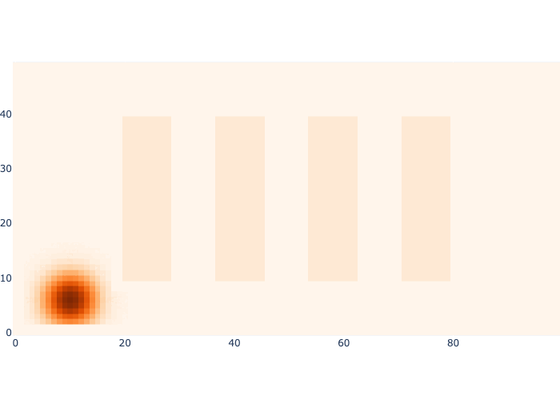

# 4.4.3.2. 仓库示例

让我们将马尔可夫定位应用于仓库示例，目前仅使用接近传感器。我们首先使用高斯先验初始化有限元素密度表示，其中心位于$$k=1$$
的真实位置，但标准差相对较大，为 5 米。我们在图 4 中展示了这一点。

```python
#| caption: Prior distribution over the robot's initial position.
#| label: fig:logistics-prior
prior_mean = values.at(x[1])
prior_cov = np.diag([25,25])
prior = logistics.gaussian(logistics.map_coords, prior_mean, prior_cov)
logistics.show_map(prior/np.max(prior)+0.1*logistics.base_map)
```

<figure><figcaption><p>图5</p></figcaption></figure>

从实现角度来看，马尔可夫定位算法中最难、计算量最大的部分是预测步骤。回想一下公式：$$ $ $$

$$
\begin{equation}
P(X_{k}|\mathcal{Z}^{k-1},\mathcal{U}^{k})=\sum_{x_{k-1}}P(X_{k}|x_{k-1},u_{k-1})P(x_{k-1}|\mathcal{Z}^{k-1},\mathcal{U}^{k-1}).
\end{equation}
$$

因此，对于预测分布网格中的每个单元格，我们需要对前一个网格中的所有单元格求和。不仅如此，对于这些$$5000^2$$
，即 2500 万个单元格组合$$(X_k,x_{k-1})$$，我们需要评估高斯运动模型$$P(X_{k}|x_{k-1},u_{k-1})$$
。使用 Python for 循环，这将相当昂贵，所以在下面的代码中我们引入了两种加速方法：

* 我们对先前网格进行外部循环，并对概率值进行阈值处理（即，如果概率值小于阈值，则在输出分布中将该值设置为 0）;
* 我们利用 `logistics.gaussian` 函数是向量化的事实，即我们可以一次处理预测网格的一整行。

快速代码可以在图 5 中找到。

```python
#| caption: Code for the Markov Localization prediction step.
#| label: code:fast-prediction
def prediction_step(previous, control, motion_model_sigma):
    """Calculate predictive density given control and control stddev."""
    cov = np.eye(2) * motion_model_sigma**2
    predictive_density = np.zeros((50,100))
    for i in range(50):
        for j in range(100):
            # Speedup 1: threshold on previous[i,j]
            if previous[i,j]>1e-5:
                previous_xy = logistics.map_coords[i,j]
                mean = previous_xy + control
                for k in range(50):
                    # Speedup 1: vectorize Gaussian evaluation over predictive row:
                    motion_model = logistics.gaussian(logistics.map_coords[k], mean, cov)
                    predictive_density[k] += motion_model * previous[i,j]
    return predictive_density/np.sum(predictive_density)
```

如果我们没有任何测量数据，但拥有完美的测量模型，我们的“控制带”会沿着高斯密度使用有限元素离散化进行推动。我们在图 6 中展示了这一点，该图显示了执行所有 14 个动作后的预测密度。

```python
#| caption: Predictive density after taking 14 actions.
#| label: fig:logistics-predictive
motion_model_sigma = 2
current_density = prior
for k in indices[:-1]:
    # prediction phase
    control = values.at(x[k+1]) - values.at(x[k]) # ground truth control
    current_density = prediction_step(current_density, control, motion_model_sigma)
logistics.show_map(current_density/np.max(current_density) + 0.1*logistics.base_map)
```

<figure><figcaption><p>图6</p></figcaption></figure>

<figure><figcaption><p>图7 预测密度的演化（无测量）。</p></figcaption></figure>

如您所见，密度无界增长，并且进入了搁板内部。没有任何测量数据，如果我们不明确地融入关于世界的知识（例如，障碍物地图），机器人就无法排除这种情况。

测量更新步骤将预测密度$$P(X_{k}|\mathcal{Z}^{k-1},\mathcal{U}^{k})$$
升级为后验密度：$$\begin{equation}
 P(X_{k}|\mathcal{Z}^{k},\mathcal{U}^{k}) \propto L(X_{k};z_{k})P(X_{k}|\mathcal{Z}^{k-1},\mathcal{U}^{k}).
 \end{equation}$$

$$
\begin{equation}
P(X_{k}|\mathcal{Z}^{k},\mathcal{U}^{k}) \propto L(X_{k};z_{k})P(X_{k}|\mathcal{Z}^{k-1},\mathcal{U}^{k}).
\end{equation}
$$

请注意这要简单得多！我们只需编写一个逐点乘法函数即可完成。由于真实轨迹永远不会接近任何货架，接近传感器始终为 `OFF` ，因此我们将预测密度与相应的 `proximity_map_off` 似然图像（如图 8 所示）相乘。

```python
#| caption: Posterior density after taking 14 actions.
#| label: fig:logistics-posterior
predictive_density = prior
posterior_density = predictive_density * logistics.proximity_map_off
posterior_density /= np.sum(posterior_density)
for k in indices[:-1]:
    # prediction phase
    control = values.at(x[k+1]) - values.at(x[k]) # ground truth control
    predictive_density = prediction_step(posterior_density, control, motion_model_sigma)
    # measurement update phase
    posterior_density = predictive_density * logistics.proximity_map_off
    posterior_density /= np.sum(posterior_density)
logistics.show_map(posterior_density/np.max(posterior_density) + 0.1*logistics.base_map)
```

<figure><figcaption><p>图8</p></figcaption></figure>

<figure><figcaption><p>图9 马尔可夫定位正在运行。</p></figcaption></figure>

图 9 展示了马尔可夫定位的实际应用！

测量信息将预测密度压缩为后验密度，该密度融合了预测信息以及来自接近传感器的知识（机器人不可能靠近货架或墙壁）。请注意，密度仍在传感器无法提供信息的方向上扩散。

