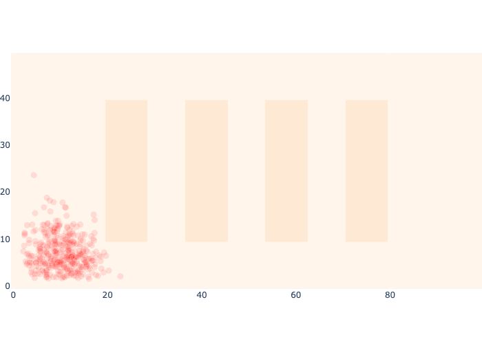

# 4.4.4.3. MCL 仓库示例

现在我们已经知道如何进行预测步骤以及评估似然函数，就能够实现整个蒙特卡洛定位方法。首先，让我们从先验分布中获得 500 个样本，如图 12 所示。

```python
#| caption: 500 samples from the prior density at the start.
#| label: fig:logistics-prior-samples
S=500
prior_samples = rng.multivariate_normal(prior_mean, prior_cov, size=S)
logistics.show_map(0.1*logistics.base_map, markers=prior_samples,
         marker=dict(size=3,color="red"))
```

<figure><figcaption></figcaption></figure>

将这种基于采样的表示与图 4 中上方的马尔可夫定位先验进行比较，并注意它们表示相同的密度，但使用了截然不同的表示方法。事实上，它们使用的资源也大相径庭：对于马尔可夫定位，我们使用了 5000 个单元，而这里我们使用 500 个样本，每个样本表示为一个二维向量。在更高维的状态空间中，这种差异更加显著。如果我们还想表示方向，会怎样呢？

然而，正如所讨论的，我们以一组加权样本$${(x_1^{(t)}, L(x_1^{(t)};z_1))}_{t = 1 \dots S}$$
开始 MCL，它代表了$$k=1$$
的后验概率。我们通过用似然对先验中的每个样本进行加权来实现这一点，如图 13 所示。

```python
#| caption: By weighting the samples with the likelihood, we get a representation for the posterior.
#| label: fig:logistics-posterior-samples
samples = prior_samples
weights = np.apply_along_axis(likelihood_off, 1, samples)
logistics.show_map(0.1*logistics.base_map, markers=samples,
         marker=dict(color="red", opacity=0.1, size=10*weights/np.max(weights)))
```

<figure><figcaption></figcaption></figure>

请注意，所有靠近墙壁和/或货架的样本都已消失，因为它们在接近传感器是 `OFF` 的情况下权重为零。所有剩余的样本权重相同。

现在让我们迭代下面代码中的所有时间步：

```python
for k in indices[:-1]:
    # prediction phase
    control = values.at(x[k+1]) - values.at(x[k])  # ground truth control
    samples = predict_samples(samples, weights, control, motion_model_sigma)
    # measurement update phase
    weights = np.apply_along_axis(likelihood_off, 1, samples)
```

```python
#| caption: Monte Carlo Localization in action!
#| label: fig:mcl_in_action
# logistics.show_map(0.1*logistics.base_map, markers=samples,
#          marker=dict(color="red", opacity=0.1, size=10*weights/np.max(weights)))
```

<figure><figcaption><p>图4 蒙特卡洛定位法在起作用。</p></figcaption></figure>

上图 15 展示了蒙特卡洛定位在运行中！

```python
#| caption: The final posterior estimate for MCL
#| label: fig:mcl_final
logistics.show_map(0.1*logistics.base_map, markers=samples,
         marker=dict(color="red", opacity=0.1, size=10*weights/np.max(weights)))
```

\


<figure><figcaption></figcaption></figure>

将 MCL 的最终后验估计与图 16 中的 Markov 定位结果进行比较，我们发现结果是一致的。不仅如此，MCL 的运行速度至少快一个数量级。

你可能想知道那些似乎放错货架之间的样品。然而，如果我们将马尔可夫定位可视化放大 10 倍，你可以在图 17 中看到，实际上那些走廊中的概率并非零。

```python
#| caption: Markov Localization visualized with a heatmap.
#| label: fig:logistics-markov-heatmap
logistics.show_map(10*posterior_density/np.max(posterior_density) + 0.1*logistics.base_map)
```

<figure><figcaption></figcaption></figure>

MCL 可以做到比马尔可夫定位更准确，因为基于样本的近似精度可以通过简单地增加样本数量来提高。当然，我们也可以增加马尔可夫定位表示的分辨率，但这需要指数级的成本。相比之下，所需的样本数量与密度占据的“体积”成正比，这一观察结果构成了粒子滤波自适应变体的基础。
